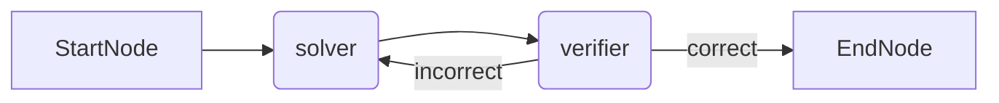
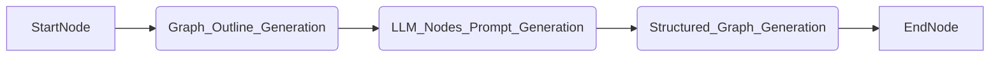

<div align="center">
  
  <h4> Autonomous AI Agents that Self-Evolve </h4>
  <h3>

[](https://ebiose.com)

[](https://discord.gg/P5pEuG5a4V) 

[](https://star-history.com/#ebiose-ai/ebiose)
[](/LICENSE)


  </h3>
</div>


# Quick start

## Installation

First, clone the repository:

```bash
git clone git@github.com:ebiose-ai/ebiose.git && cd ebiose
```

Ebiose uses [uv](https://docs.astral.sh/uv/) as a packaging and dependency manager. See [Astral's uv documentation](https://docs.astral.sh/uv/getting-started/installation/) to install it.  

If you don't want to use `uv`, you can still use the `requirements.txt` file for installing the dependencies with `pip` or `conda`.

## Install Project Dependencies with uv

Once uv is installed, use it to install your project dependencies. In your project directory, run:

```sh
uv sync
```

For more detailed instructions or troubleshooting tips, refer to the [official uv documentation](https://docs.astral.sh/uv/).

> 💡 For the following, you may need to add the root of the repository to your `PYTHONPATH` environment variable. You may also use a `.env` file to do so.

## Understand forges and forge cycles

To understand the basics of Ebiose, you may now look at the Jupyter notebook [quickstart.ipynb](notebooks/quickstart.ipynb). This notebook allows you to try architect agents on your very own problematic.

## Implement your own forge

In `./examples/math_forge/`, you will find a partical example of a complete forge made to generate and optimize agents specialized in solving math problems. 

To run a cycle of the Math forge, execute the following command in your project directory:

```sh
uv run ./examples/math_forge/run.py
```

As soon as first agents have been written in the save path, you can evaluate an agent by executing:

```sh
uv run ./examples/math_forge/evaluate.py
```

Start from here to implement your own forge, with the corresponding `compute_fitness` method.

## LLM model APIs support

As of today, the easiest way to experiment with Ebiose is to use the OpenAI API. To do so, all you have to do is to set your OpenAI API key via an `.env` file or by executing:

```bash
export OPENAI_API_KEY=<your_openai_api_key>
```

To use other LLM providers, you may refer to [LangChain's API support](https://python.langchain.com/docs/integrations/llms/) and modify our [LangChain backend implementation](ebiose/backends/langgraph/compute_intensive_batch_processor.py) accordingly.

## Code overview

Ebiose let's you create autonomous agents with a declarative approach.
You describe the problem you want to solve and Ebiose's architect agents build
an autonomous agent to tackle it.

Validation is made trough Pydantic V2 and the backend is in LangChain's [LangGraph](https://github.com/langchain-ai/langgraph),
altough other backends may be implemented

The project is made of three modules.

### The `agents` module

This `agents` module contains the `Graph` class which is, to date, the way Ebiose represents
the workflow of an agent.

An agent's graph is composed of nodes and edges. A node embodies a step in the overall workflow of an agent.
So far, there are three types of nodes implemented:

- `StartNode` that is used to define the entry point of the graph;
- `EndNode` that is used to define the output point of the graph;
- `LLMNode` which involves calling an LLM with a specific prompt Calls a LLM with a specific prompt.

Here is an example of graph that can be expressed with Ebiose's `agents` module:

<div align="center">



**Example of a graph made to solve math problems**

</div>

### The `architect_agents` module

This module is used to generate Ebiose agents based on a problem
description to be solved. For now, there is only a so-called "three steps architect"
implemented as an Ebiose agent itself, with the `agents` module.

<div align="center">



**The three-steps architect agent**

</div>

### The `backends` module

The `backends` module implements all that is necessary to turn an Ebiose's agent into
an executable Ebiose's agent. With modularity in mind, this step relies on other external libraries.

As of today, Ebiose's executable agents rely on [LangGraph](https://github.com/langchain-ai/langgraph).

## Learn more

To understand the key concepts of Ebiose, you may want to explore the following notebooks:

- [`notebooks/quick_start.ipynb`](notebooks/quick_start.ipynb) which is a quick start guide to generate an agent with the architect agent and run it;
- [`notebooks/ebiose_agent_basics.pynb`](notebooks/ebiose_agent_basics.pynb) which shows a simple example of a manually implemented Ebiose's agent that is then executed with LangGraph;
- [`notebooks/ebiose_architect_basics.ipynb`](notebooks/ebiose_architect_basics.ipynb) which explains how the architect agent works under the hood.

## Roadmap


## Contact

For any question, comment, idea or else, feel free to ask on [Discord](https://discord.gg/naewTgYnDt) and directly create an issue.

**All feedback will be very valuable. Thanks.**


- title (reprendre le template du premier repo)
- uv install
- what to expect and not expect now
- lien article et glossaire

optionnel:
- roadmap
- code overview
- idée de choses à faire
    - faire des forges d'agent architecte
    - implémenter des noeuds
- docs

Markdown Preview Mermaid Support - Visual Studio Marketplace

